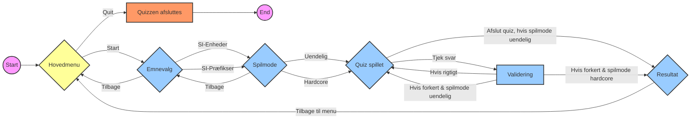

# Fysik-quiz-app
## 1. Beskrivelse af Projektets Formål og Målgruppe
Formålet med denne applikation er at tilbyde gymnasieelever en nem og tilgængelig måde at øve og forstå SI-enheder og SI-præfikser på. Målgruppen er gymnasieelever, der tager fysik som et fag, og som søger en interaktiv metode til at styrke deres kendskab til dette essentielle område inden for fysik. Appen er designet til at være intuitiv, hvilket gør den ideel for elever, der ønsker en hurtig og effektiv læringsressource.

## 2. Benyttede Designmønstre
Vi har valgt at benytte os af Command-mønstret, som er en del af de adfærdsmæssige designmønstre. Dette mønster er særligt effektivt til at håndtere funktionskald og operationer, hvilket gør det ideelt til en app, der kræver interaktivitet og responsivitet. Ved at anvende dette mønster, har vi øget appens modulære natur og gjort det lettere at vedligeholde og udvide funktionaliteten over tid.
Læs mere om mønstret her: https://refactoring.guru/design-patterns/command

## 3. Beskrivelse af udviklingsprocessen
Vi startede med at brainstom en masse idéer, om hvad vi ville lave en app til, hvor vi meget hurtigt fandt ud af, at vi ville lave en fysik app. Vi tænkte derefetr på, hvilke emner inden for fysik, som vi ville basere vores app på, og da tænkte vi på det mest simple og mest brugte i fysik, som er SI-enheder og Præfikser. Vi overvejede også at implementere symboler, men mange af de samme symboler bruges til flere eforskellige ting, så vi holdte det bare til de to valgte. 
Inden vi gang i gang med koden og "UI", så skitserede vi, hvordan vores UI skulle være. Vi valgte antal menuer, svarmuligheder, 
I koden begyndte vi først at designe vores UI, hvor vi designede og tilføjede vores "Tkinter labels" og "Tkinter buttons". Vi implementerede derefter forskellige metoder og klasser for at forbedre koden og gøre den mere anvendelig.
Vi har også lavet koden, så man nemt kan tilføje et ekstar spørgsmål og svar under vores data-sæt (dictionary).

## 4. Beskrivelse af brugergrænsefladen.

## 5. Et skema med test.
| Titel | Test trin | Forventet resultat | Aktuelle resultat |
| ----------- | ----------- | ----------- | ----------- | 
| Initialisering af hovedmenuen | <ol> <li> Lav en instans af quiz appen </li> </ol> | Hovedmenuen med en 'start' og 'quit' knap vises | Som forventet |
| Afslutning af quiz | <ol> <li> Lav en instans af quiz appen. </li> <li> Klik på knappen 'quit'. | Quiz appen afsluttes | Som forventet |
| Initialisering af emnevalg | <ol> <li> Lav en instans af quiz appen </li> <li> Klik på knappen 'start' </li> </ol> | Emnevalgs menuen vises med 3 knapper 'SI-Enheder', 'SI-Præfikser' og 'Tilbage' | Som forventet |
| Initialisering af spilmode | <ol> <li> Lav en instans af quiz appen </li> <li> Klik på knappen 'start' </li> <li> Klik på enten 'SI-Enheder' eller 'SI-Præfikser' </ol> | Valg af spilmod vises med 3 knapper 'Uendelig', 'Hardcore' og 'Tilbage' | Som forventet |
| Initialisering af spilmode | <ol> <li> Lav en instans af quiz appen </li> <li> Klik på knappen 'start' </li> <li> Klik på enten 'SI-Enheder' eller 'SI-Præfikser' </li> </ol> | Valg af spilmod vises med 3 knapper 'Uendelig', 'Hardcore' og 'Tilbage' | Som forventet |
| Initialisering af quizzen | <ol> <li> Lav en instans af quiz appen </li> <li> Klik på knappen 'start' </li> <li> Klik på enten 'SI-Enheder' eller 'SI-Præfikser' </li> <li> Klik på enten 'Uendelig' eller 'Hardcore' </li> </ol> | Quizzen vises, med et spørgsmål øverst, under er 4 knapper med svar muligheder og nederst er en 'tjek svar' knap. Under står din score. Hvis du har valgt spilmoden 'uendelig' er der en knap 'afslut quiz' | Som forventet |
| Ved rigtigt svar i uendelig spilmode | <ol> <li> Følg trinene i 'Initialisering af quizzen', sørg for at vælge uendelig mode. </li> <li> Besvar spørgsmålet korrelt </li> </ol> | Tjek svar knappen bliver grøn, der bliver tilføjet adderet 1 til din score, og der kommer et nyt spørgsmål og svar muligheder | Som forventet |
| Ved forkert svar i uendelig spilmode | <ol> <li> Følg trinene i 'Initialisering af quizzen', sørg for at vælge uendelig mode. </li> <li> Besvar spørgsmålet forkert </li> </ol> | Tjek svar knappen bliver rød, og der kommer et nyt spørgsmål og svar muligheder | Som forventet |
| Ved rigtigt svar i hardcore spilmode | <ol> <li> Følg trinene i 'Initialisering af quizzen', sørg for at vælge hardcore mode. </li> <li> Besvar spørgsmålet korrelt </li> </ol> | Tjek svar knappen bliver grøn, der bliver tilføjet adderet 1 til din score og der kommer et nyt spørgsmål og svar muligheder | Som forventet |
| Ved forkert svar i hardcore spilmode | <ol> <li> Følg trinene i 'Initialisering af quizzen', sørg for at vælge hardcore mode. </li> <li> Besvar spørgsmålet forkert </li> </ol> | Tjek svar knappen bliver rød, og efterfølgende vises dit resultat, med en knap 'tilbage til menu'| Som forventet |
| Ved klik på 'tilbage til menu' | <ol> <li> Følg trinene i 'Ved forkert svar i hardcore spilmode'. </li> <li> Klik på 'tilbage til menu' </li> </ol> | Du bringes tilbage til hovedmenuen| Som forventet |
| Ved klik på 'afslut quiz' | <ol> <li> Følg trinene i 'Initialiserings af spilmode', sørg for at vælge uendelig mode. </li> <li> Klik på 'afslut quiz' </li> </ol> | Din score vises, under ses en knap 'tilbage til menu'| Som forventet bortset fra der vises antal ukorrekte svar ved siden af scoren |

## 6. Reflektion over brugen af design pattern
